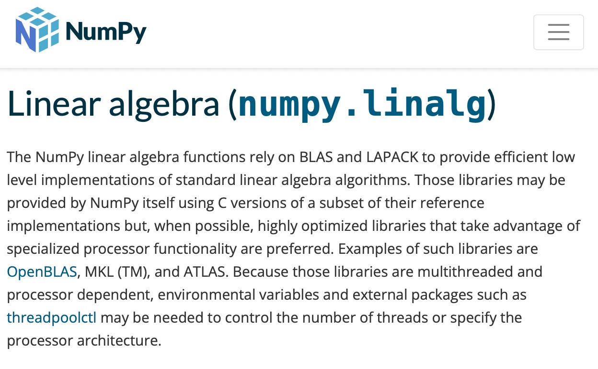
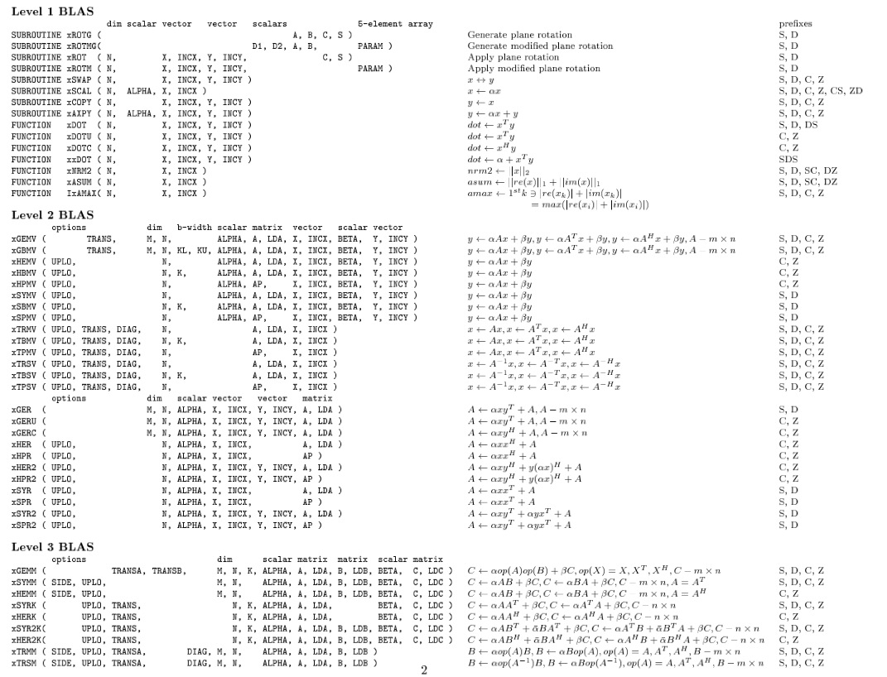
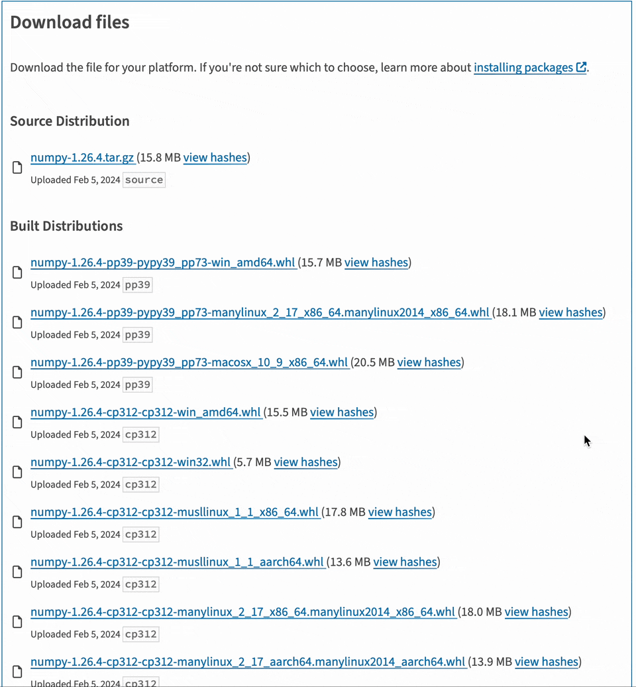
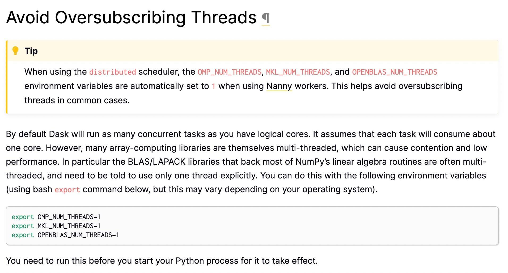
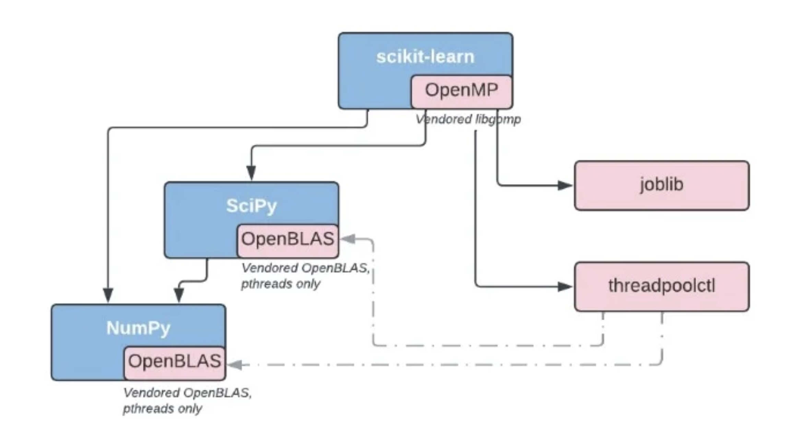

title: Parallelism in Numerical Python Libraries
use_katex: False
class: title-slide

# Parallelism in Numerical Python Libraries

.larger[Thomas J. Fan]<br>

<a href="https://www.github.com/thomasjpfan" target="_blank" class="title-link"><span class="icon icon-github right-margin"></span>@thomasjpfan</a>

<a class="this-talk-link", href="https://github.com/thomasjpfan/parallelism-numerical-python-talk" target="_blank">
This talk on Github: github.com/thomasjpfan/parallelism-numerical-python-talk</a>

---

class: chapter-slide

# 🔒 Global Interpreter Lock (GIL)? 🔒

---


---

# My Perspective

.g[
.g-6[
## Parallelism in Scikit-learn
- BLAS through SciPy
- OpenMP + Cython
- Python Multi-Threading
- Python Multi-Processing
]
.g-6[

]
]


---


# Scope?

.g[
.g-4[

]
.g-4[

]
.g-4[

]
]

---

# Overview

.g[
.g-6.center[
## Configuration

]
.g-6.center[
## Implementation

]
]

---


# NumPy Parallelism 🚀


---

class: chapter-slide

# Demo: `np.add` vs `@` (matmul) 🧪

---

# Questions 🤔

- When is NumPy parallel?
- How is `linalg` implemented?
- How to configure parallelism for `linalg`?

---

# When is NumPy parallel?

.center[

]

### https://numpy.org/doc/stable/reference/routines.linalg.html

---

#  How is `linalg` implemented?

.center[
## BLAS (Basic Linear Algebra Subprograms)
## LAPACK (Linear Algebra PACKage)
]

.g.g-middle[
.g-6[
- **OpenBLAS**
- **MKL**: Intel's Math Kernel Library
- **BLIS**: BLAS-like Library Instantiation Software
]
.g-6[

]
]

.footnote-back[
[Source](https://netlib.org/blas/)
]

---

class: top, top-5

# Which BLAS is my library using?

--

## Use `threadpoolctl`!

```bash
python -m threadpoolctl -i numpy
```

--

## Output for `OpenBLAS`:

```json
{
    "user_api": "blas",
*   "internal_api": "openblas",
    "prefix": "libopenblas",
    "filepath": "...",
    "version": "0.3.21",
*   "threading_layer": "pthreads",
    "architecture": "Zen",
*   "num_threads": 32
}
```

---

class: top, top-5

# Which BLAS is my library using?

## Output for `MKL`:

```json
{
    "user_api": "blas",
*   "internal_api": "mkl",
    "prefix": "libmkl_rt",
    "filepath": "...",
    "version": "2022.1-Product",
*   "threading_layer": "intel",
    "num_threads": 16
}
```

---

# How select BLAS implementation?

.g.g-middle[
.g-6[
## PyPI
### Only `OpenBLAS` (with `pthreads`)
]
.g-6[
## Conda-forge
```
conda install "libblas=*=*mkl"
conda install "libblas=*=*openblas"
conda install "libblas=*=*blis"
conda install "libblas=*=*accelerate"
conda install "libblas=*=*netlib"
```

[Read more here](https://conda-forge.org/docs/maintainer/knowledge_base.html#switching-blas-implementation)
]
]

---

# How to configure parallelism for NumPy's `matmul` `@`?
## 1. Environment variables
## 2. `threadpoolctl`

---

# Controlling Parallelism with environment variables

- `OPENBLAS_NUM_THREADS` (With `pthreads`)
- `MKL_NUM_THREADS` (Intel's MKL)
- `OMP_NUM_THREADS` (OpenMP)
- `BLIS_NUM_THREADS`

---

class: top, top-10

# `threadpoolctl`

## Context manager

```python
from threadpoolctl import threadpool_limits
import numpy as np

*with threadpool_limits(limits=4):
    a = np.random.randn(1000, 1000)
    a_squared = a @ a
```

--

## Globally

```python
threadpool_limits(limits=4)
```

---

# Pytorch CPU Parallelism 🚀
## Parallel by default!

.g.g-middle[
.g-8[
## Configuration
- `OMP_NUM_THREADS` or `MKL_NUM_THREADS`
- `torch.set_num_threads`
]
.g-4[

]
]

---

# Parallelism in scikit-learn  🖥


---

# Parallelism in scikit-learn  🖥

.g.g-middle[
.g-8[
- Python Multithreading
- Python Multiprocessing (with `loky` backend)
- OpenMP routines (**Parallel by default**)
- Inherits `linalg` BLAS semantics from NumPy and SciPy (**Parallel by default**)
]
.g-4[

]
]

---

class: top, top-5

# Parallelism in scikit-learn  🖥
## Python Multithreading

--

- `RandomForestClassifier` and `RandomForestRegressor`
- LogisticRegression with `solver="sag"` or `"saga"`
- Method calls to `kneighbors` or `radius_neighbors`

--

## Configuration
- `n_jobs` parameter

```python
forest = RandomForestClassifier(n_jobs=4)
```

---

class: top, top-5

# Parallelism in scikit-learn  🖥
## Python Multiprocessing

- `HalvingGridSearchCV` and `HalvingRandomSearchCV`
- `MultiOutputClassifier`, etc

--

## Configuration
- `n_jobs` parameter

```python
from sklearn.experimental import enable_halving_search_cv
from sklearn.model_selection import HalvingRandomSearchCV

*halving = HalvingGridSearchCV(..., n_jobs=4)
```

---

class: top, top-10

# Multithreading vs Multiprocessing in Python

.g[
.g-6[
## Multithreading
- Need to think about the Global Interpreter Lock (**GIL**)
- Shared memory
- Spawning threads is faster
]
.g-6[
]
]

---

class: top, top-10

# Multithreading vs Multiprocessing in Python

.g[
.g-6[
## Multithreading
- Need to think about the Global Interpreter Lock (**GIL**)
- Shared memory
- Spawning threads is faster
]

.g-6[
## Multiprocessing
- Likely need to think about memory
- Different [start methods](https://docs.python.org/3/library/multiprocessing.html#contexts-and-start-methods):
    - **spawn** (Default on Windows and macOS)
    - **fork** (Default on Unix)
    - **forkserver**
]
]

---

.g.g-middle[
.g-8[
# loky
- Detects worker process failures
- Reuse existing pools
- Processes are spawned by default
]
.g-4[

]
]

Learn more at [loky.readthedocs.io/en/stable/](https://loky.readthedocs.io/en/stable/)

---

# Python Multiprocessing: Memory

<br>


---

# Parallelism in scikit-learn  🖥
## Python Multiprocessing: memmapping


---

class: top

# Parallelism in scikit-learn  🖥
## OpenMP

- **Parallel by default**

--

- `HistGradientBoostingRegressor` and `HistGradientBoostingClassifier`

--

- Routines that use pairwise distances reductions:
    - `metrics.pairwise_distances_argmin`
    - `manifold.TSNE`
    - `neighbors.KNeighborsClassifier` and `neighbors.KNeighborsRegressor`
    - [See here for more](https://scikit-learn.org/stable/auto_examples/release_highlights/plot_release_highlights_1_1_0.html#performance-improvements)

--

## Configuration
- `OMP_NUM_THREADS`
- `threadpoolctl`

---

# Parallelism in polars 🐻‍❄️


- **Parallel by default**
- Uses `pthreads` with rust library: `rayon-rs/rayon`
- Environment variable: `POLARS_MAX_THREADS`

[github.com/pola-rs/polars](https://github.com/pola-rs/polars)

---

# UMAP
## **Parallel by default** with Numba


[Source](https://umap-learn.readthedocs.io/en/latest/index.html)

---


# Parallelism with Numba

.g.g-middle[
.g-8[
## Configuration
- Environment variable: `NUMBA_NUM_THREADS`
- Python API: `numba.set_num_threads`
]
.g-4[

]
]

--

## Threading layers
- Open Multi-Processing (OpenMP)
- Intel Threading Building Blocks (TBB)
- workqueue (Numba's custom threadpool using `pthreads`)

---

class: top

<br>

# AOT vs Numba

.g[
.g-6[
.center[
## AOT

]

- **Ahead of time** compiled
- Harder to build
- Less requirements during runtime
]
.g-6[
]
]

---

class: top

<br>

# AOT vs Numba

.g[
.g-6[
.center[
## AOT

]

- **Ahead of time** compiled
- Harder to build
- Less requirements during runtime
]
.g-6[

]
]

---

class: top

<br>

# AOT vs Numba

.g[
.g-6[

.center[
## AOT

]

- **Ahead of time** compiled
- Harder to build
- Less requirements during runtime
]
.g-6[

.center[
## Numba

]

- **Just in time** compiled
- Source code is Python
- Requires compiler at runtime
]
]

---

.g.g-middle[
.g-6[
# Configuration 💻
.larger[
- Environment Variables 🌲
- Global Configuration 🌎
- Block Configuration 🧱
- Call-site ☎️
]
]
.g-6.g-center[

]
]

---

.g.g-middle[
.g-8[

# Environment Variables 🌲

.larger[
- **OpenMP**: `OMP_NUM_THREADS`
- **MKL**: `MKL_NUM_THREADS`
- **OpenBLAS**: `OPENBLAS_NUM_THREADS`
]
]
.g-4[

]
]

---

.g.g-middle[
.g-8[

# Environment Variables 🌲

.larger[
- **OpenMP**: `OMP_NUM_THREADS`
- **MKL**: `MKL_NUM_THREADS`
- **OpenBLAS**: `OPENBLAS_NUM_THREADS`
- **Polars**: `POLARS_MAX_THREADS`
- **Numba**: `NUMBA_NUM_THREADS`
- **macOS accelerate**: `VECLIB_MAXIMUM_THREADS`
- **numexpr**: `NUMEXPR_NUM_THREADS`
]
]
.g-4[

]
]

---

# Global Configuration 🌎

.g.g-middle[
.g-8[
.larger[
- `torch.set_num_threads`
- `numba.set_num_threads`
- `threadpoolctl.threadpool_limits`
- `cv.setNumThreads`
]
]
.g-4[

]
]

---

# Block Configuration 🧱
## `threadpoolctl`

```python
from threadpoolctl import threadpool_limits
import numpy as np

*with threadpool_limits(limits=2):
    a = np.random.randn(1000, 1000)
    a_squared = a @ a
```

---

# Call-site ☎️

.g.g-middle[
.g-8[
.larger[
- **scikit-learn**: `n_jobs`
- **SciPy**: `workers`
- **PyTorch DataLoader**: `num_workers`
- **Python**: `max_workers`
]

]
.g-4[

]
]

---

class: chapter-slide

# Too Much Parallelism 🧵 + 🧶

---

# Oversubscription 💥
## Python + native threading 🐍 + 🧵

```python
from scipy import optimize

optimize.brute(
*    computation_that_uses_8_cores, ...
*    workers=8
)
```

---

# Scikit-learn Avoiding Oversubscription  🖥

.g.g-middle[
.g-8[
- Automatically configures native threads to **`cpu_count() // n_jobs`**
- Learn more in [joblib's docs](https://joblib.readthedocs.io/en/latest/parallel.html#avoiding-over-subscription-of-cpu-resources)
]
.g-4[

]
]

---

class: top-5, top

# Scikit-learn Avoiding Oversubscription Example

```python
from sklearn.experimental import enable_halving_search_cv
from sklearn.model_selection import HalvingGridSearchCV
from sklearn.ensemble import HistGradientBoostingClassifier

*clf = HistGradientBoostingClassifier()  # OpenMP
gsh = HalvingGridSearchCV(
    estimator=clf, param_grid=param_grid,
*   n_jobs=n_jobs  # loky
)
```

--

## Timing the search ⏰

```python
%%time
gsh.fit(X, y)
# CPU times: user 15min 57s, sys: 791 ms, total: 15min 58s
*# Wall time: 41.4 s
```

---

# Timing results
<!--
| n_jobs | OMP_NUM_THREADS | duration (sec)  |
|--------|-----------------|-----------------|
| 1      | unset           | 42              |
| 1      | 1               | 74              |
| 1      | 16              | 42              |
| 16     | unset           | 8               |
| 16     | 1               | 8               |
| 16     | 16              | over 600        | -->


---
# Timing results


---

# Timing results


---

# Timing results


---

# Current workarounds 🩹
## Dask 



[Source](https://docs.dask.org/en/stable/array-best-practices.html#avoid-oversubscribing-threads)

---


[Source](https://docs.ray.io/en/latest/serve/scaling-and-resource-allocation.html#configuring-parallelism-with-omp-num-threads)

---

# PyTorch's DataLoader

.g.g-middle[
.g-8[
```python
from torch.utils.data import DataLoader

dl = DataLoader(..., num_workers=8)

# torch/utils/data/_utils/worker.py
def _worker_loop(...):
    ...
*   torch.set_num_threads(1)
```
]
.g-4.center[

]
]

---

class: top

<br><br><br><br>

# Multiple Parallel Abstractions 🧵 + 🧶


- Python multiprocessing using `fork` + GCC OpenMP: **stalls**

--

- Intel OpenMP + LLVM OpenMP on Linux: **stalls**

--

- Multiple OpenBLAS libraries (`NumPy` and `SciPy` on `PyPI`): **sometimes slower**

--

- Read more at: [thomasjpfan.github.io/parallelism-python-libraries-design/](https://thomasjpfan.github.io/parallelism-python-libraries-design/)

---

# Multiple Parallel Abstractions 🧵 + 🧶
## Using more than one parallel backends 🤯


Sources: [polars](https://pola-rs.github.io/polars-book/user-guide/howcani/multiprocessing.html),
[numba](https://numba.pydata.org/numba-doc/latest/user/threading-layer.html),
[scikit-learn](https://scikit-learn.org/stable/faq.html#why-do-i-sometime-get-a-crash-freeze-with-n-jobs-1-under-osx-or-linux),
[pandas](https://pandas.pydata.org/pandas-docs/stable/user_guide/enhancingperf.html#caveats)

---

class: top

<br><br>

# Proposal: Catch issues early 🔮

.g.g-middle[
.g-10[

]
.g-2.center[

]
]
[Source](https://github.com/numba/numba/blob/249c8ff3206928b486346443ec148508f8c25f8e/numba/np/ufunc/omppool.cpp#L119-L121)

---

class: center

## Not a full solution 🩹

---

# Multiple Native threading libraries 🧵 + 🧶

.center[

]

[Source](https://www.slideshare.net/RalfGommers/parallelism-in-a-numpybased-program)

---

# Multiple Native threading libraries 🧵 + 🧶
## CPU Waiting ⏳

```python
for n_iter in range(100):
    UV = U @ V.T             # Use OpenBLAS with pthreads
    compute_with_openmp(UV)  # Use OpenMP
```

[xianyi/OpenBLAS#3187](https://github.com/xianyi/OpenBLAS/issues/3187)

---

# Current Workaround 🩹

.g.g-middle[
.g-6[
## Conda-forge + OpenMP
]
.g-6.center[

]
]

---

# Current Workaround  🩹

.center[

]

[Source](https://www.slideshare.net/RalfGommers/parallelism-in-a-numpybased-program)

---

class: top

# Proposal 🔮

## Ship PyPI wheels for OpenMP or BLAS


---

## Not a full solution 🩹

.g.g-middle[
.g-6[

]
.g-6[

]
]

---


---

class: center

# Parallelism in Numerical Python Libraries

.larger[Thomas J. Fan]<br>

<a href="https://www.github.com/thomasjpfan" target="_blank" class="title-link"><span class="icon icon-github right-margin"></span>@thomasjpfan</a>

<a class="this-talk-link", href="https://github.com/thomasjpfan/parallelism-numerical-python-talk" target="_blank">
This talk on Github: github.com/thomasjpfan/parallelism-numerical-python-talk</a>

---

class: chapter-slide

# Appendix 🪄

---

# Python GIL + Parallelism? 👀

- Python Multi-threading: Release the GIL
- Python Multi-processing: Each process gets it's own GIL
- Native multi-threading: Release the GIL

---

# PEP 684 🔮: Sub-Interpreters
## Need to explore, it could work ☀️

---

# PEP 703 🔮: No-GIL
## Also Promising, but harder lift for Python
